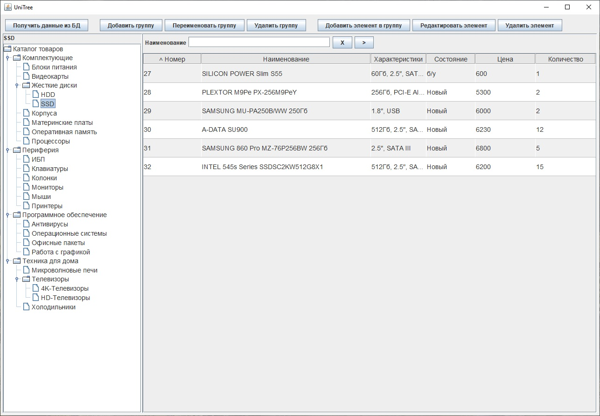
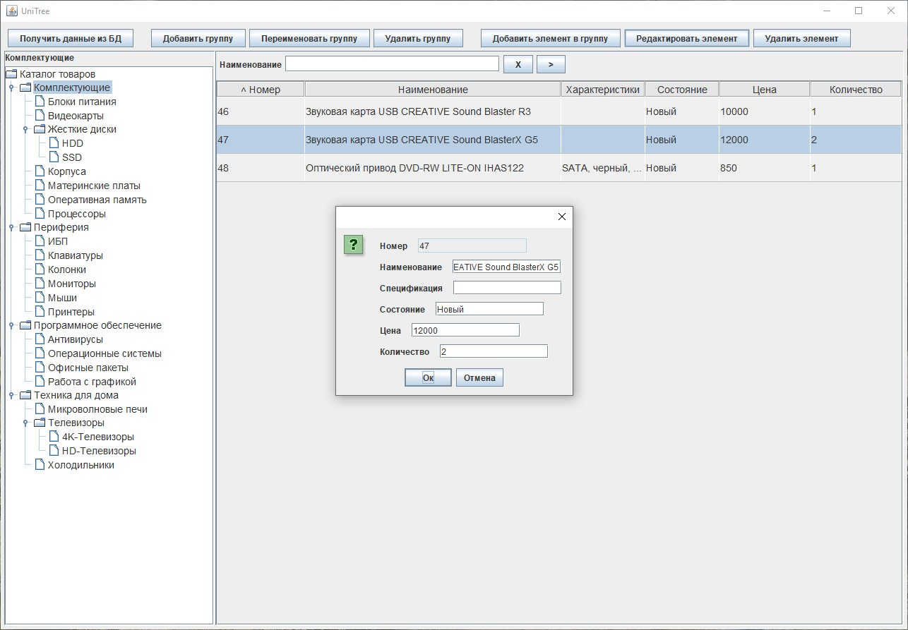
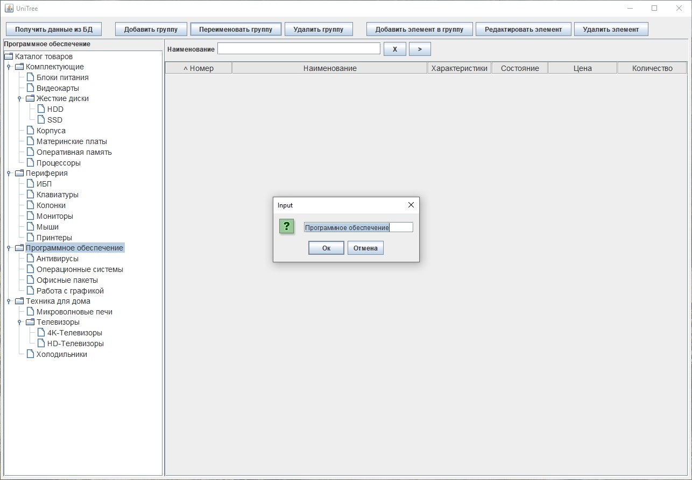

# CatalogComponent

Данный проект - попытка создать универсальный компонент, который мог бы отображать данные любых иерархически организованных справочников и продемонстрировать работу этого компонента на примере простой базы данных. Ранее я [уже делал что-то похожее](https://github.com/SergeyLebidko/HierarchicalCatalog), но тот проект имел один достаточно весомый недостаток: справочник был организован в виде одной таблицы базы данных и мог хранить чрезвычайно ограниченный набор сведений о своих компонентах. Фактически, это были сведения только о наименовании элемента и всё.
В этом же проекте я создал структуру, которая является гораздо более гибкой. Сведения о группах находятся в одной таблице (и описываются в программе объектами класса Group). Сведения о элементах этих групп хранятся в связанной таблице и описываются объектами, удовлетворяющими интерфейсу GroupDataElement. Элементы могут хранить любую информацию: например, информацию о сотрудниках организации или о товарах на складе, или о деталях какого-либо изделия и т.д. Для своего примера я выбрал сведения о товарах, разбитых на отдельные группы.
Сведения об отдельном товаре хранятся в классе Product.
Для выполнения операций с БД предусмотрен класс CatalogDAO, использующий шаблон Spring JDBCTemplate (очень удобная штука, избавляющая от необходимости писать кучу однотипного кода!). Класс ActionHandler служит для выполнения команд пользователя. Он как бы увязывает между собой классы доступа к данным и классы графического интерфейса. Класс UniTree реализует универсальный компонент отображения информации из справочника. С левой стороны отображается дерево групп. С правой - содержимое этих групп. Для вывода содержимого групп я использовал уже  [написанный](https://github.com/SergeyLebidko/UniTable) мною ранее универсальный табличный компонент (с небольшими модификациями).
Скриншоты проекта приведены ниже:

